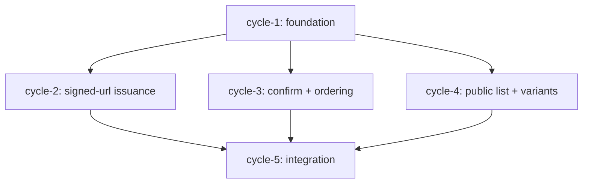

# S-1.3 Image Upload Pipeline — Run Context

## Orientation

This run lands the **backend-only** image upload pipeline for S-1.3. Sellers can upload
up to 8 images per listing via direct-to-R2 upload (short-lived SigV4 presigned URLs).
After upload, the client calls a confirm endpoint to register the image server-side.
Delivery is via Cloudflare Images variant URLs (`card` / `thumb` / `detail`), which
strip EXIF automatically. The mobile picker UI integration is a separate client story.

Five ACs decompose into five cycles: one serial foundation cycle, three parallel feature
cycles (run concurrently in separate worktrees), and one serial integration cycle.

## New / modified files

```
lib/
├── db/
│   └── schema.ts                          (modified — append listingImages table)
├── server/
│   ├── app.ts                             (modified — wire three image routes)
│   ├── r2/
│   │   └── presign.ts                     (new — aws4fetch SigV4 presigner)
│   ├── images/
│   │   └── variant-url.ts                 (new — buildVariantUrl / buildVariants)
│   └── routes/
│       ├── listings-images-upload-url.ts  (new — POST /api/listings/:id/images/upload-url)
│       ├── listings-images-confirm.ts     (new — POST /api/listings/:id/images/confirm)
│       └── listings-images-list.ts        (new — GET  /api/listings/:id/images)
drizzle/
└── 0001_images.sql                        (new — migration adding images table)
```

Tests under `lib/server/__tests__/`:

- `listings-images-upload-url.test.ts` (cycle-2)
- `listings-images-confirm.test.ts` (cycle-3)
- `listings-images-list.test.ts` (cycle-4)
- `listings-images-integration.test.ts` (cycle-5)

And `lib/db/__tests__/schema.test.ts` extended in cycle-1.

## Dep graph



Wave 1 (serial):   cycle-1
Wave 2 (parallel): cycle-2, cycle-3, cycle-4
Wave 3 (serial):   cycle-5

## Test commands

```bash
bun run typecheck && bun run lint && bun run test:ci

bun test lib/server/__tests__/listings-images-upload-url.test.ts
bun test lib/server/__tests__/listings-images-confirm.test.ts
bun test lib/server/__tests__/listings-images-list.test.ts
bun test lib/db/__tests__/schema.test.ts
```

## Ontology

See [`../ontology-updates.md`](../ontology-updates.md) for proposed new terms:
`listing_image`, `signed_upload_url`, `cf_images_variant`, `image_confirm`, `primary_image`.

## ADR index

| # | File | Topic |
|---|------|-------|
| 0001 | `0001-signed-url-ttl-and-content-type-pinning.md` | TTL ≤5 min, content-type pinning, 10 MB cap via `x-amz-content-length-range` |
| 0002 | `0002-exif-strip-via-cloudflare-images.md` | EXIF delegation to CF Images variant pipeline |
| 0003 | `0003-r2-presigner-in-workers.md` | `aws4fetch` SigV4 presigner for Workers |
| 0004 | `0004-images-table-schema.md` | `images` table columns, no `is_primary` unique constraint, missing FK rationale |
| 0005 | `0005-variant-url-construction.md` | `buildVariants()` location, three variant names, extensibility |

## Key implementation conventions for cycle authors

- **DB mock pattern**: `where()` must return `Promise.resolve([...])` — see `listings-gate.test.ts`. Raw array returns silently break `await`.
- **Error logging**: use `serializeError(err)` from `~/lib/logger` consistently. `onboarding-start.ts` logs `{ err }` directly; that's a known carry-forward issue, not the pattern to copy.
- **Ownership gate**: implement `ownsListing(listingId, userId, db)` as a local async function inside each route file (not a new middleware). Cycle-5 wires `clerkAuth()` + inline ownership check per route, not a blanket `app.use`.
- **`listing_id` FK gap**: the `listings` table doesn't exist yet. The migration SQL should comment out the FK (`-- REFERENCES listings(id)`). The Drizzle schema must omit `.references()`.
- **`aws4fetch` presign**: cycle-2 must verify `x-amz-content-length-range` support before finalising the presigner. If absent, use the hand-rolled fallback described in ADR-0003.
- **`crypto.randomUUID()`**: available in both Workers (`globalThis.crypto`) and Bun/Node test environments. Use it for `id` generation in the confirm handler.
