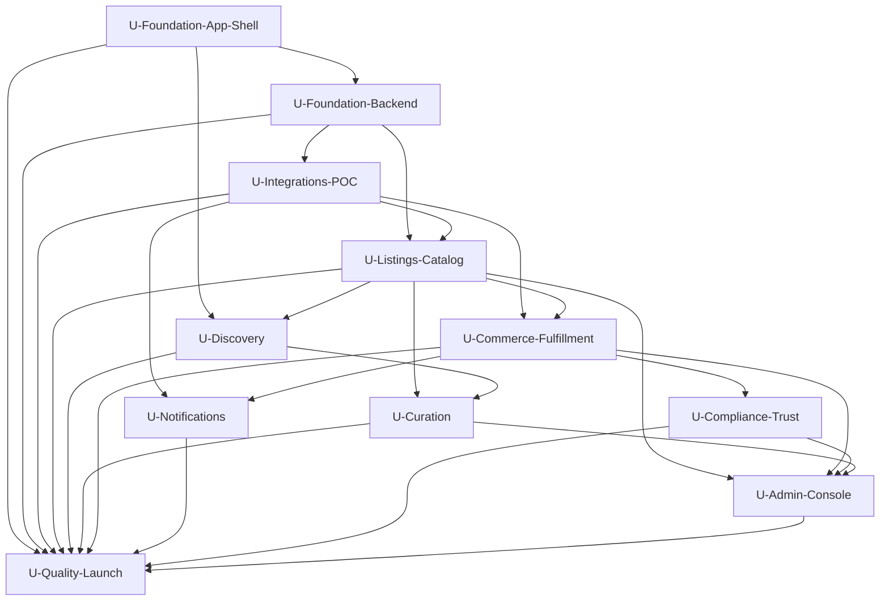

# Sleeve Architecture
**"An Infinite Longbox"**

| Field | Value |
|---|---|
| Version | 1.0 |
| Date | 2026-05-10 |
| Status | Complete |
| Spec | Arc42 v8 (sections 1–12) + Gnar appendices A–D |
| Source PRD | `ideate/PRD.md` v1.0 (37 REQ-IDs) |

---

## 1. Introduction and Goals

Sleeve ("An Infinite Longbox") is a mobile-first, Tinder-style swipe marketplace for rare comics, delivered as a single Expo (React Native + Web) codebase for iOS, Android, and Web. v1 is US-only fixed-price transactions with a curator/marketplace hybrid model. Live auctions, in-house grading, social features, and cross-border commerce are explicitly out of scope.

### 1.1 Requirements Overview

Top-level Must-Have requirements (full list in PRD §5.1–5.3, traceability in Appendix C):

| REQ-ID | Requirement | Priority |
|---|---|---|
| REQ-001 | Swipe-driven discovery feed | Must |
| REQ-002 | Filter system over the swipe deck | Must |
| REQ-003 | Curated/featured decks | Must |
| REQ-004 | Seller listing creation | Must |
| REQ-005 | Buyer purchase flow (fixed price, single-item) | Must |
| REQ-006 | Payment processing — platform-escrow model | Must |
| REQ-007 | Shipping coordination | Must |
| REQ-008 | Dual buyer/seller account modes | Must |
| REQ-009 | Seller trust signals (open + verified badge) | Must |
| REQ-010 | Buyer ratings of sellers | Must |
| REQ-011 | Dispute/claim flow | Must |
| REQ-012 | Cross-platform delivery via Expo | Must |
| REQ-013 | Authentication — email + phone OTP | Must |
| REQ-020 | Swipe gesture performance ≥60fps | Must |
| REQ-021 | Image load latency in deck | Must |
| REQ-022 | Payment & transaction durability | Must |
| REQ-023 | PCI compliance via processor (SAQ-A) | Must |
| REQ-024 | KYC at 1099-K threshold | Must |
| REQ-025 | US marketplace facilitator sales tax | Must |
| REQ-026 | Counterfeit/IP takedown process | Must |
| REQ-027 | Accessibility — WCAG 2.1 AA | Must |
| REQ-030–035 | Stripe Connect, Shippo, Image CDN, Auth provider, Tax provider, Notifications | Must |

### 1.2 Quality Goals

| Priority | Quality Goal | Motivation |
|---|---|---|
| 1 | **Swipe feels native** — 60fps gesture, sub-100ms next-card render on Wi-Fi | The swipe loop is the product. If it doesn't feel good, nothing else matters. REQ-020, REQ-021. |
| 2 | **Money is correct** — no lost orders, no double-charges, no leaked payouts | Trust is the moat for rare comics. One incident permanently damages the brand. REQ-022. |
| 3 | **Launch-legal** — PCI SAQ-A, marketplace facilitator sales tax, KYC at threshold, takedown SLA | Marketplace regulatory exposure is concrete and avoidable. REQ-023, REQ-024, REQ-025, REQ-026. |
| 4 | **Single-codebase parity** — iOS, Android, Web ship from one Expo project | Founder-stage cost discipline. REQ-012. |
| 5 | **Accessible** — WCAG 2.1 AA on web; native a11y on mobile | Reach + legal hygiene. REQ-027. |

### 1.3 Stakeholders

| Role | Name / Team | Expectations |
|---|---|---|
| Founder / Product | alxjrvs | Product direction, vendor relationships, beta cohort, brand-led launch |
| Solution Architect / Tech Lead | TBD (20%) | ADRs, swipe-perf reviews, payout state machine reviews, security sign-off |
| Agentic Engineer 1 — App | TBD | Expo client, swipe runtime, listings UI |
| Agentic Engineer 2 — Backend | TBD | API, Postgres, Stripe Connect, escrow state machine, workers |
| UX/UI Designer | TBD (0.2–0.3 FTE) | Design system, swipe card, listing flow, admin UX |
| Legal / Compliance | Retainer | Marketplace facilitator scope, ToS, privacy, takedown appeals |
| Beta cohort sellers | LCS partners + dealers | First 10–20 sellers in M3 closed beta |
| Beta cohort buyers | Comics collector community | First 100+ active buyers driving validation metrics |

---

## 2. Architecture Constraints

| Type | Constraint | Rationale |
|---|---|---|
| Technical | **Expo (React Native + Web)** is the client platform | Locked in PRD §1.0 and §3.3. Single codebase across iOS, Android, Web. |
| Technical | **Stripe Connect Express** for marketplace payments | PRD assumption A1 + REQ-030. Deferred-KYC posture per REQ-024. |
| Technical | **Grand Comics Database (GCD)** as the primary catalog source | REQ-036. Licensing terms to be confirmed in M1. |
| Technical | **PCI SAQ-A scope** — no card data on platform | REQ-023. Forces tokenization-only Stripe integration. |
| Technical | **Postgres-only data store v1** | Founder-stage operational simplicity. Search uses Postgres FTS until ~50K listings. |
| Organizational | **US-only v1** | Locked in PRD §2.2 and §5.4. Scopes KYC, tax, customs. |
| Organizational | **Two senior agentic engineers** + part-time architect/designer/PM | Locked in Phase 3 staffing. |
| Organizational | **Funding-driven timeline**, not date-driven | PRD §3.3. Scope ladders to validation milestones, not a fixed launch date. |
| Organizational | **Swipe UI is invariant** | Product constraint: filters narrow the deck but never replace the swipe UI. PRD §2.2 and §5.1 REQ-001. |
| Regulatory | **Marketplace facilitator sales tax** in covered US states | REQ-025. Drives the Stripe Tax integration and pre-launch state registration work. |
| Regulatory | **KYC at $600 cumulative payouts** | REQ-024. 1099-K threshold gates next-payout transition. |
| Regulatory | **Counterfeit takedown SLA <24h** | REQ-026. Drives admin tooling and runbook scope in M3. |

---

## 3. System Scope and Context

### 3.1 Business Context

| Actor | Input | Output | Description |
|---|---|---|---|
| **Buyer** | Swipes, filters, purchases, ratings, claims | Listings shown, orders confirmed, tracking, refunds, payout protection | The Hunter / Browser personas. Authenticated via Clerk. |
| **Seller** | Listings (photos + metadata), shipping labels, claim responses | Sales, payouts, KYC status, performance dashboard | The Operator persona. Onboarded via Stripe Connect Express. |
| **Editor (Admin)** | Curated deck composition, moderation actions, dispute mediations | Featured decks, takedown decisions, escalations | Founder/staff acting as editorial + moderator. |
| **Moderator (Admin)** | Reviews of reported listings, dispute evidence | Takedown, restore, dispute resolutions | Subset of admin role focused on safety. |
| **Stripe Connect** | Payment events, payout events, KYC events | Webhooks driving order state machine | Money-of-record. |
| **Shippo / EasyPost** | Rate quotes, label purchase, tracking events | Webhooks driving fulfillment state machine | Fulfillment-of-record. |
| **GCD** | Issue/series catalog | Metadata, cover thumbnails | Catalog-of-record for listing prefill. |
| **Tax provider (Stripe Tax)** | Order line items + ship-to | Tax line; remittance reports | Tax-of-record. |

### 3.2 Technical Context

| Channel / Interface | Protocol | Direction | Description |
|---|---|---|---|
| Expo App ↔ Backend API | HTTPS / REST | Bidirectional | TanStack Query client; Zod-validated bodies; bearer JWT |
| Admin Console ↔ Backend API | HTTPS / REST | Bidirectional | Same API surface, admin-only endpoints gated by role claim |
| Backend API ↔ Workers | Redis / BullMQ | Internal | Job enqueue for image processing, notification fanout, payout transitions |
| Backend ↔ Stripe Connect | HTTPS / REST + Webhooks | Bidirectional | Account, PaymentIntent, Transfer, Account Link |
| Backend ↔ Shippo | HTTPS / REST + Webhooks | Bidirectional | Rate, Label, Tracking |
| Backend ↔ GCD | HTTPS / REST | Outbound (read) | Issue/series lookup; results cached in Postgres |
| Backend ↔ Clerk | HTTPS / SDK + Webhooks | Bidirectional | Session, user, MFA enforcement |
| Backend ↔ Cloudflare R2 + Images | HTTPS / signed URLs | Bidirectional | Direct-to-storage uploads; transform variants for cards/thumbs |
| Backend ↔ Tax provider | HTTPS / REST | Outbound | Calc-at-checkout |
| Backend ↔ Notification providers | HTTPS / REST | Outbound | Expo Push, Postmark |
| Sentry / Datadog | HTTPS / SDK | Outbound | Errors, logs, metrics, traces |
| GitHub Actions ↔ Fly.io / Cloudflare / EAS | HTTPS / CLI | Outbound | CI/CD pipelines |

---

## 4. Solution Strategy

| Goal | Approach | Technology / Pattern |
|---|---|---|
| Tinder-style swipe on a US comics marketplace | Single Expo codebase; server-ranked decks with client-side prefetch; Reanimated + Gesture Handler for 60fps | Expo SDK 55, React Native, Expo Router, Reanimated, Gesture Handler |
| Curator/marketplace hybrid | Same swipe runtime, two deck sources (editorial-published vs filtered search) | DeckSource abstraction; admin DeckBuilder authors editorial decks |
| Payments with escrow + US tax | Stripe Connect Express, destination charge with delayed transfer until delivery confirmation; Stripe Tax; cumulative-payout watcher triggers KYC at 1099-K threshold | Stripe Connect, Stripe Tax, PayoutStateMachine worker |
| Image-first discovery | Direct-to-CDN uploads, transform variants, lazy prefetch | Cloudflare R2 + Images |
| Founder-stage cost discipline | Single managed Postgres, one server runtime, vendor-managed auth + tax + payments | Neon Postgres, Clerk auth, Fly.io runtime, Upstash Redis |
| WCAG 2.1 AA + native a11y | Accessible design-system primitives from M1; axe-core in CI for web; native a11y labels enforced via lint rule | Storybook + axe Playwright, eslint-plugin-react-native-a11y |
| Money correctness | Stripe is source of truth for funds; idempotent webhooks; property-based tests around the payout state machine | Drizzle + Zod + invariant tests |
| Multi-platform parity | Single codebase, single OpenAPI surface, shared Zod schemas | bun monorepo with `packages/shared` |

---

## 5. Building Block View

### 5.1 Level 1 — System Overview

Each building block is a unit of work (per the milestones in Phase 1). Units map 1:1 to deliverable groups.

#### Unit: U-Foundation-App-Shell (M1: 1A + 1E)

**Purpose:** Provide the Expo monorepo, dev tooling, CI, design system, and navigation skeleton so every subsequent feature has a place to ship.

**Responsibilities:**
- Monorepo + bun workspaces (`apps/app`, `apps/admin`, `apps/server`, `apps/workers`, `packages/shared`)
- Lint / typecheck / format / git hooks
- Test infrastructure (Vitest, Playwright web, Detox native smoke)
- CI/CD pipelines (GitHub Actions; EAS for native; Fly + Cloudflare Pages for web)
- Expo Router navigation, design system primitives, dark mode, account/profile screen
- Cross-platform parity gates (REQ-012)

**Deliverables:** see audit `## Milestones` §1A + §1E.

**Dependencies:** none.

---

#### Unit: U-Foundation-Backend (M1: 1B + 1D)

**Purpose:** The canonical API surface, data model, auth, and operations baseline. Everything else depends on this.

**Responsibilities:**
- REST API (Hono) with OpenAPI 3.0 generated from Zod
- Postgres schema: users, seller_accounts, listings, media, orders, decks, audit_log
- Auth integration (Clerk) + RBAC (buyer/seller/admin/moderator)
- Image upload pipeline (signed URLs to R2; transform variants via Cloudflare Images)
- Structured logging, error tracking (Sentry), metrics (Datadog), feature flags, secret management
- Generated TS client for the app and admin to consume

**Deliverables:** see audit `## Milestones` §1B + §1D.

**Dependencies:** U-Foundation-App-Shell (for shared types and CI).

---

#### Unit: U-Integrations-POC (M1: 1C)

**Purpose:** Prove the four external regulated integrations work end-to-end before any feature depends on them.

**Responsibilities:**
- Stripe Connect Express sandbox onboarding + first sandbox charge (REQ-006, REQ-030)
- GCD catalog adapter, read-only, with TTL cache (REQ-016, REQ-036)
- Notification POC: Expo Push + Postmark sandbox (REQ-014, REQ-035)
- Tax provider sandbox calculation (REQ-025, REQ-034)

**Deliverables:** see audit `## Milestones` §1C.

**Dependencies:** U-Foundation-Backend.

---

#### Unit: U-Discovery (M2: 2A) — *complex, Level 2 below*

**Purpose:** The swipe surface — the invariant core of the product.

**Responsibilities:**
- Server-side deck composition for any filter combination
- Client swipe runtime sustaining 60fps on reference devices
- Filter UI that narrows decks but never replaces the swipe shell
- Like/Pass/Save persistence (REQ-001, REQ-002, REQ-020, REQ-021)

**Deliverables:** see audit `## Milestones` §2A.

**Dependencies:** U-Foundation-Backend, U-Foundation-App-Shell, U-Listings-Catalog.

---

#### Unit: U-Listings-Catalog (M2: 2B)

**Purpose:** Seller-side listing lifecycle and the catalog-aware listing creation flow.

**Responsibilities:**
- Multi-step listing draft → publish with GCD prefill (REQ-004, REQ-016)
- Media management (multi-image, ordering, primary) (REQ-004, REQ-032)
- Listings index + Postgres FTS search + facet indexes (REQ-002, REQ-009)
- Open marketplace browse surface coexisting with swipe (REQ-001)

**Deliverables:** see audit `## Milestones` §2B.

**Dependencies:** U-Foundation-Backend, U-Integrations-POC (GCD), U-Foundation-App-Shell.

---

#### Unit: U-Curation (M2: 2C)

**Purpose:** Editorial decks — the "curator" half of the hybrid model.

**Responsibilities:**
- Admin DeckBuilder UI (web admin) (REQ-003)
- Featured tab in the buyer app; deck → swipe transition reuses the swipe runtime (REQ-003)
- Editorial metadata: title, hero, blurb, tags

**Deliverables:** see audit `## Milestones` §2C.

**Dependencies:** U-Listings-Catalog, U-Discovery.

---

#### Unit: U-Commerce-Fulfillment (M2: 2D) — *complex, Level 2 below*

**Purpose:** The money-correctness lane. Drives a buyer purchase end-to-end through escrow, shipping, and payout.

**Responsibilities:**
- Cart (1-item), checkout, PaymentIntent (REQ-005, REQ-006)
- Escrow state machine (hold → ship → deliver → release → payout) (REQ-006, REQ-022)
- Shipping label purchase + tracking ingestion (REQ-007, REQ-031)
- Buyer ratings post-transaction (REQ-010)
- Order history surfaces for buyer + seller

**Deliverables:** see audit `## Milestones` §2D.

**Dependencies:** U-Integrations-POC (Stripe + Shippo), U-Listings-Catalog.

---

#### Unit: U-Notifications (M2: 2E)

**Purpose:** Push, email, and in-app inbox driven by domain events.

**Responsibilities:**
- Expo Push registration + delivery for lifecycle events (REQ-014, REQ-035)
- Postmark transactional email for the same events (REQ-014, REQ-035)
- In-app activity inbox; per-user preferences; quiet hours

**Deliverables:** see audit `## Milestones` §2E.

**Dependencies:** U-Integrations-POC (notifications), U-Commerce-Fulfillment.

---

#### Unit: U-Compliance-Trust (M3: 3A)

**Purpose:** Make the marketplace launch-legal — KYC at threshold, tax, disputes, takedowns.

**Responsibilities:**
- ThresholdWatcher worker → Stripe Account Link before next payout (REQ-024)
- Stripe Tax integrated at checkout (REQ-025, REQ-034)
- Buyer dispute flow → seller response → admin resolution → payout adjust (REQ-011)
- Verified seller badge derived from KYC + 5 clean sales (REQ-009, REQ-010)
- Counterfeit/fraud reporting + takedown SLA <24h (REQ-026)

**Deliverables:** see audit `## Milestones` §3A.

**Dependencies:** U-Commerce-Fulfillment.

---

#### Unit: U-Admin-Console (M3: 3B)

**Purpose:** The internal operating surface for editors, moderators, and finance.

**Responsibilities:**
- Admin auth + MFA + audit log of all admin mutations
- Moderation queue, dispute mediation, financial ops, user/listing lookup
- Seller dashboard exposed to sellers via the app (REQ-017 — Should-Have, deferred if needed)

**Deliverables:** see audit `## Milestones` §3B.

**Dependencies:** U-Foundation-Backend, U-Listings-Catalog, U-Commerce-Fulfillment, U-Compliance-Trust.

---

#### Unit: U-Quality-Launch (M3: 3C)

**Purpose:** Quality, performance, accessibility, security, reliability, and the actual launch.

**Responsibilities:**
- Accessibility audit; axe-core in CI; native a11y labels (REQ-027)
- Performance hardening to hit REQ-020/021 SLOs
- Third-party pen test, dependency audit, OWASP review (REQ-022, REQ-023)
- Backups + restore drill + DR runbook (REQ-028)
- SLO dashboards + alerts (REQ-028, REQ-029)
- iOS App Store + Google Play submission; web production deploy (REQ-012)
- Closed beta with seed sellers + buyers — drives §6.1 validation metrics

**Deliverables:** see audit `## Milestones` §3C.

**Dependencies:** all preceding units.

---

### 5.2 Level 2 — Unit Internals (complex units only)

#### Unit: U-Discovery — Internals

##### Subcomponent: `DeckComposer` (server)
**Purpose:** Resolve a filter set to a paginated, ranked queue of listings.
**Interfaces:** REST `/decks/compose` returns N=25 cards with a continuation cursor; consumes Postgres `listings` + FTS/facet indexes; reads editorial deck membership from `decks` table.
**Key decisions:** Ranking blend = recency × seller-tier × novelty (no-machine-learning v1); cache by (filter-hash, user-id) with short TTL; deterministic dedupe across pages.

##### Subcomponent: `DeckSource` (client)
**Purpose:** Abstraction over the origin of cards — filtered search vs editorial-published.
**Interfaces:** Observable queue consumed by `CardRenderer`; backed by TanStack Query infinite query.
**Key decisions:** Editorial decks and filtered decks share the same downstream pipeline; the only difference is the source URL.

##### Subcomponent: `CardRenderer` (client)
**Purpose:** Render the listing card — image-first, with grade chip, price, seller badge.
**Interfaces:** Reads from `DeckSource`; renders Cloudflare Images variants by device pixel density.
**Key decisions:** Two-layer rendering — placeholder LQIP first, then sharp variant — to satisfy REQ-021 latency budgets.

##### Subcomponent: `GestureLayer` (client)
**Purpose:** Pan/throw gestures with velocity threshold; haptic feedback.
**Interfaces:** Reanimated + Gesture Handler; emits like/pass/save action events.
**Key decisions:** Web parity uses click + drag with reduced animation amplitude; documented as a known limitation in M2.

##### Subcomponent: `AffinityStore` (client)
**Purpose:** Local-first store of like/pass/save state per user, synced to server.
**Interfaces:** SQLite (Expo SQLite) on native; IndexedDB on web; sync queue to API.
**Key decisions:** Offline-capable; sync is idempotent; conflicts resolved server-side last-write-wins on rare reconnect.

##### Subcomponent: `EmptyState`
**Purpose:** Preserve the swipe shell when filters narrow the deck to zero results.
**Interfaces:** Renders within the card stack region.
**Key decisions:** Filters never replace the swipe UI; this subcomponent makes that constraint explicit.

#### Unit: U-Commerce-Fulfillment — Internals

##### Subcomponent: `CheckoutController` (server)
**Purpose:** Validate cart, compute tax, create PaymentIntent.
**Interfaces:** REST `/orders` POST; reads `listings`; calls Stripe + Tax; writes `orders` + `order_items`.
**Key decisions:** Idempotency keys on PaymentIntent creation; tax is computed before charging; PaymentIntent uses destination = platform with `transfer_data` deferred until `release`.

##### Subcomponent: `PayoutStateMachine` (worker)
**Purpose:** Drive an order through Hold → Shipped → Delivered → Released → PaidOut.
**Interfaces:** Consumes Stripe webhooks (`payment_intent.succeeded`, `charge.refunded`), Shippo webhooks (`tracking_updated`, `tracking_delivered`); writes `orders.state` and emits domain events.
**Key decisions:** State transitions are append-only events into `order_events`; invariant tests assert that every order's released_amount equals charge_amount minus refunds minus platform fees.

##### Subcomponent: `ShippingAdapter` (server + worker)
**Purpose:** Encapsulate Shippo/EasyPost behind a stable interface so we could swap aggregators.
**Interfaces:** `rate`, `purchaseLabel`, `getTracking`, `onTrackingWebhook`.
**Key decisions:** Webhook signature verified before any state mutation; normalized event taxonomy across carriers.

##### Subcomponent: `DisputeController` (server)
**Purpose:** Manage buyer disputes; pause payout; route to admin mediation.
**Interfaces:** REST `/disputes` POST/PATCH; reads/writes `disputes` table; emits events to `PayoutStateMachine`.
**Key decisions:** Disputes pause payouts but don't refund automatically; admin resolution drives money movement; Stripe chargeback events are reconciled into the same table.

##### Subcomponent: `ThresholdWatcher` (worker)
**Purpose:** Monitor cumulative payouts per seller; gate next payout on KYC at $600.
**Interfaces:** Scheduled job + event-driven recompute on payout release; triggers Stripe Account Link emission.
**Key decisions:** Threshold is the 1099-K limit; admin override path exists; banner shown in-app before block.

### 5.3 Build Order

| Order | Unit | Rationale |
|---|---|---|
| 1 | U-Foundation-App-Shell | Repo + tooling gate everything else |
| 2 | U-Foundation-Backend | API + DB + auth foundation gates all features |
| 3 | U-Integrations-POC | Proves the four regulated integrations work before features depend on them |
| 4 | U-Listings-Catalog | Listings are the substrate for both swipe and commerce |
| 5 | U-Discovery | Built on listings; the product's invariant surface |
| 6 | U-Curation | Reuses the swipe runtime; needs listings + a minimal admin |
| 7 | U-Commerce-Fulfillment | Built on listings + Stripe POC |
| 8 | U-Notifications | Built on commerce domain events |
| 9 | U-Compliance-Trust | Built on commerce; gates launch |
| 10 | U-Admin-Console | Built on all of the above; needed in M3 |
| 11 | U-Quality-Launch | Closes out the project |

### 5.4 Dependency Matrix



---

## 6. Runtime View

Scenarios for each Must-Have requirement (happy paths). Errors and edge cases are covered in §8.5.

### Scenario: Buyer swipes a filtered deck (REQ-001, REQ-002, REQ-003, REQ-020, REQ-021)

1. Buyer opens the app → Clerk session bootstraps → app fetches `GET /decks/compose?filters=...&cursor=...`.
2. `DeckComposer` resolves filters against `listings` + facet indexes, ranks, returns N=25 cards plus continuation cursor.
3. `DeckSource` populates the client queue; `CardRenderer` renders LQIP placeholder, then sharp Cloudflare Images variant.
4. Buyer swipes; `GestureLayer` emits `like`/`pass` event; `AffinityStore` persists locally and syncs.
5. When N drops below the prefetch threshold, `DeckSource` requests the next page.
6. Empty result → `EmptyState` renders within the swipe shell; user can broaden filters without leaving the surface.

Critical decision points: ranking model (no-ML v1); prefetch window N (default 8); LQIP-to-sharp transition timing.

### Scenario: Seller creates a listing (REQ-004, REQ-016)

1. Seller opens listing flow → app calls `POST /listings/draft` → server creates draft row.
2. Seller searches GCD via `GET /catalog/search?q=...` → `GCDAdapter` returns issue/series matches with cached results.
3. Seller selects a match → server prefills attributes; seller may override.
4. Seller uploads images → app requests `POST /uploads/sign` → uploads directly to R2 → reports completion to `PATCH /listings/draft`.
5. Cloudflare Images generates variants asynchronously; thumbs become available within seconds.
6. Seller publishes → `POST /listings/publish` validates required fields → listing becomes filter-eligible.

Critical decision points: GCD-fail fallback (manual entry path); image variant readiness vs publish timing (eventual-consistent acceptable for non-primary variants).

### Scenario: Buyer purchases a listing (REQ-005, REQ-006, REQ-022, REQ-023)

1. Buyer taps Buy → app calls `POST /orders` with listing id + saved payment method.
2. `CheckoutController` validates listing-still-available, computes tax via Stripe Tax, creates Stripe `PaymentIntent` with `destination=platform`, `transfer_data` deferred.
3. Buyer confirms in Stripe Elements (Stripe-hosted; SAQ-A); PaymentIntent transitions to `succeeded`.
4. Stripe webhook → worker → `PayoutStateMachine` transitions order to `Hold`; listing reserved.
5. Notifications fan out: seller is paged via Push + email.

Critical decision points: idempotency on PaymentIntent creation; reservation atomicity; SAQ-A compliance via Stripe Elements only.

### Scenario: Seller ships; tracking drives release; payout (REQ-006, REQ-007, REQ-022, REQ-031)

1. Seller opens order → `POST /orders/{id}/label` → `ShippingAdapter` quotes rates → seller selects → label PDF returned.
2. Tracking number written to `orders`; Shippo webhooks deliver `tracking_in_transit` → `tracking_delivered`.
3. `PayoutStateMachine` transitions to `Delivered`; the 7-day auto-release window starts.
4. Buyer confirms receipt (or window expires) → `Released` → Stripe `Transfer` created → seller balance accrues.
5. Stripe `payout.paid` webhook → order to `PaidOut`; notifications dispatched.

Critical decision points: tracking event normalization; manual override path for admin; auto-release timing.

### Scenario: Buyer rates the seller (REQ-010)

1. 24 hours after `Released`, app surfaces rating prompt.
2. Buyer submits 1–5 stars + optional written review → `POST /sellers/{id}/ratings`.
3. Server validates rater is the order's buyer; writes `ratings` row; recomputes seller rating aggregates.
4. Rating contributes to verified-tier eligibility check (REQ-009).

### Scenario: Buyer files a dispute (REQ-011)

1. Buyer in escrow window → app `POST /orders/{id}/disputes` with evidence and category.
2. `DisputeController` writes dispute; `PayoutStateMachine` transitions order to `Disputed` (payout paused).
3. Seller notified with 72h response SLA.
4. Seller responds → admin reviews in `ModerationQueue` → admin issues resolution (refund / partial / release).
5. `PayoutStateMachine` consumes resolution; funds movement reconciles with Stripe.

Critical decision points: SLA timing; partial refund support; chargeback alignment with Stripe.

### Scenario: Editor builds a curated deck (REQ-003)

1. Editor opens Admin → `DeckBuilder` → searches listings → drags to deck.
2. `POST /admin/decks` writes deck metadata + member ids.
3. Editor publishes → deck becomes a `DeckSource` source for buyer-facing Featured tab.
4. Buyer-side surface uses the same swipe runtime — only the source URL differs.

### Scenario: Seller crosses 1099-K threshold; KYC triggered (REQ-024, REQ-030)

1. `ThresholdWatcher` worker recomputes cumulative payouts on every `release` event.
2. When cumulative crosses 80% of threshold → in-app banner + email prompts seller to start KYC.
3. When cumulative reaches threshold → next `Released → PaidOut` transition is blocked; Stripe Account Link sent.
4. Seller completes Stripe-hosted KYC → webhook updates seller account → blocked payouts unfreeze.

Critical decision points: gate is forward-only (not retroactive); admin override path exists for edge cases.

### Scenario: Buyer reports a listing as counterfeit; admin takes it down (REQ-026)

1. Buyer taps "Report listing" → `POST /listings/{id}/reports` → moderation queue.
2. Moderator reviews evidence within 24h SLA → soft-hide listing.
3. Seller notified with appeal path (REQ-026); appeal returns to moderation queue.
4. After appeal window or appeal denial → hard-delete; refund any in-flight orders.

### Scenario: Lifecycle event triggers notifications (REQ-014, REQ-035)

1. Domain event (sold, shipped, delivered, rated, disputed, paid) is emitted by `PayoutStateMachine` or `DisputeController`.
2. `NotificationFanout` worker reads user preferences, dispatches to Expo Push + Postmark.
3. In-app inbox row is written for activity feed.

### Scenario: Sales tax calculated at checkout (REQ-025, REQ-034)

1. `CheckoutController` calls Stripe Tax with cart + ship-to before PaymentIntent.
2. Stripe Tax returns tax line; persisted on the order.
3. Stripe Tax handles remittance reports for marketplace-facilitator states.

### Scenario: User signs in (REQ-008, REQ-013, REQ-033)

1. User enters email or phone → Clerk issues OTP → user confirms.
2. Clerk emits session JWT → app calls `GET /me` → server returns role-aware view.
3. If user has a seller account, app exposes seller-mode toggle without re-login.

### Scenario: Cross-platform parity check (REQ-012, REQ-027)

1. Every release runs Detox smoke on iOS + Android and Playwright + axe-core on Web in CI.
2. WCAG AA violations fail the build on web.
3. Release notes capture any documented platform parity deltas (e.g., gesture differences on web).

---

## 7. Deployment View

| Environment | Host / Platform | Notes |
|---|---|---|
| **Dev** | Local Expo + local API; per-developer Neon branch | `bun run dev` boots app + admin + server; Stripe/Shippo sandbox |
| **Preview (per-PR)** | Cloudflare Pages (admin) + Fly.io preview app (API) + Neon ephemeral branch | Auto-cleaned on PR close |
| **Staging** | Production-mirror sizing | Stripe/Shippo sandbox; real GCD reads; beta cohort exposure in M3 |
| **Production** | Fly.io (API + workers), Neon (Postgres), Upstash (Redis), Cloudflare R2 + Images + Pages | Autoscaling enabled; on-call rotation post-launch |

### 7.1 Deployment Topology

| Component | Host | Notes |
|---|---|---|
| Backend API | Fly.io app | Region: `iad` primary; autoscale 2–10 machines |
| Workers (BullMQ) | Fly.io separate app | Same code, different start command; autoscale 1–5 |
| Postgres | Neon | Production project with autoscaling; PITR enabled |
| Redis | Upstash | Global pay-per-request; for queues + rate limits |
| Object storage | Cloudflare R2 | Bucket per environment; signed-URL uploads |
| CDN + image transforms | Cloudflare Images | Public delivery via image-resizing URLs |
| Mobile app distribution | Apple App Store + Google Play | Build + submit via EAS |
| Web app distribution | Cloudflare Pages (admin) + Fly static (app web build) | EAS publishes web bundle |
| Errors | Sentry | One project per surface (app, admin, api, workers) |
| Observability | Datadog | Logs + APM + metrics; SLOs configured in M3 |
| Push | Expo Notifications | APNs + FCM credentials provisioned in Apple/Google consoles |
| Email | Postmark | Domain + DKIM/SPF configured |
| Secrets | Fly secrets + 1Password vault | Rotation runbook in M3 |

### 7.2 Release Process

- App: `main` → EAS production builds → store submission (manual approval gate).
- API + workers: `main` → Fly deploy with blue/green strategy; auto-rollback on health check failure.
- Admin: `main` → Cloudflare Pages production deploy.
- Migrations: forward-only; run by CI before API deploy; gated on staging soak.

---

## 8. Cross-cutting Concepts

### 8.1 Tech Stack

| Layer | Technology | Version / Notes |
|---|---|---|
| Client framework | Expo SDK 55 | React Native + Web |
| Client language | TypeScript | strict |
| Navigation | Expo Router | File-based, deep links |
| Data fetching | TanStack Query | Cache + retries |
| Gesture / animation | Reanimated + Gesture Handler | 60fps swipe |
| Backend runtime | Node.js 20 LTS | |
| Backend framework | Hono | OpenAPI via `@hono/zod-openapi` |
| ORM | Drizzle | Type-safe SQL |
| Database | PostgreSQL 16 (Neon) | Serverless, branching |
| Queues + cache | Redis (Upstash) + BullMQ | Serverless Redis |
| Validation | Zod | Shared schemas |
| Auth | Clerk | Sessions + MFA |
| Payments | Stripe Connect Express + Stripe Tax | |
| Shipping | Shippo (primary) / EasyPost (alternate) | |
| Storage + CDN | Cloudflare R2 + Cloudflare Images | |
| Push + email | Expo Notifications + Postmark | |
| Errors | Sentry | App + server with release tagging |
| Observability | Datadog | Logs + APM + metrics |
| Analytics | PostHog | Events + flags |
| Monorepo | bun workspaces | Single repo |
| CI/CD | GitHub Actions + EAS + Fly + Cloudflare Pages | |

### 8.2 Architectural Patterns

- **Layered API**: HTTP handler → service → repository → DB. Workers consume the same service layer.
- **Event-driven money movement**: order state transitions emit events into `order_events`; workers reconcile against Stripe/Shippo webhooks.
- **Adapter pattern at every external boundary**: `ShippingAdapter`, `CatalogAdapter`, `TaxAdapter`, `AuthAdapter`, `PaymentsAdapter`. Vendors are swappable.
- **Local-first client state for `AffinityStore`**: offline-capable swipe.
- **Shared schemas package**: Zod definitions in `packages/shared` produce TS types and OpenAPI; consumed by app, admin, and server.
- **Idempotency keys on all money-mutating endpoints**.

### 8.3 Conventions

- File structure: `apps/{app,admin,server,workers}/src/...` + `packages/shared/src/...`.
- Naming: PascalCase for components and types; camelCase for variables and functions; kebab-case for file names; SCREAMING_SNAKE for environment variables.
- Lint: ESLint with `eslint-plugin-react-native-a11y` enforced; `bun audit` in CI.
- Tests live next to code (`Foo.tsx` + `Foo.test.tsx`); integration tests in `apps/server/test`.
- Commit style: conventional commits (`feat:`, `fix:`, `chore:` …) — user-level preference.
- Branching: rebase + squash to `main`, linear history.

### 8.4 Security

| Layer | Controls |
|---|---|
| Network | TLS 1.3; Cloudflare WAF on public API + admin |
| Auth | Clerk-managed sessions; JWT verified server-side; refresh rotation; admin MFA mandatory |
| Authorization | RBAC: `buyer`, `seller`, `admin`, `moderator`; per-row ownership checks; audit log on admin mutations |
| Data at rest | Neon and R2 default encryption; secrets in Fly + 1Password |
| Data in motion | TLS 1.3; webhook signature verification (Stripe, Shippo, Clerk); request signing on internal worker calls |
| PCI | SAQ-A — Stripe Elements / Stripe-hosted onboarding; no card data in our infra (REQ-023) |
| Image content | EXIF stripped on upload; configurable max size; moderation hooks |
| Secrets | No secrets in repo; pre-commit secret scanning; rotation runbook |
| Dependencies | Renovate bot + `bun audit` in CI; lockfile committed |
| Threat model | Top exposures: webhook replay (mitigated by signature + idempotency); admin account compromise (MFA + audit log); counterfeit listing (takedown SLA + moderation) |

### 8.5 Error Handling

- **HTTP**: server returns RFC 7807 problem details with stable `code` strings; client maps codes to user-friendly messages from a shared catalog.
- **Webhooks**: signature-verified, idempotent, ack-then-process via queue; retries with exponential backoff; dead-letter queue for poison messages with on-call alert.
- **Payment failures**: surfaced to buyer immediately via Stripe Elements; order remains in `Created` (not `Hold`) until PaymentIntent succeeds.
- **Network failures (app)**: TanStack Query retries idempotent reads; mutations show error state and surface manual retry; offline `AffinityStore` queues sync.
- **Money invariants**: any state transition writes to `order_events`; nightly reconciliation job compares aggregated event sums against Stripe balance.
- **Logging**: correlation IDs propagate through HTTP + workers + webhooks; structured logs with PII redaction at boundary.
- **Crashes**: Sentry alerts at >0.5% crash-free-session degradation; release tagging enables fast revert.

---

## 9. Architecture Decisions

### ADR-001: Expo (React Native + Web) for the client

**Status:** Accepted

**Context:** PRD §1.0 specifies "Expo, React Native + Web." Mobile-first, US-only, single team. We need iOS, Android, and Web from one codebase to keep founder-stage costs down.

**Decision Drivers:**
- Single codebase across iOS, Android, Web
- Founder-stage cost discipline (one team, one toolchain)
- Best-in-class native build pipeline (EAS) without standing up our own
- Animation/gesture libraries strong enough for 60fps swipe (REQ-020)

**Considered Options:**

#### Option A: Expo SDK 55 (React Native + Web)
- Good: One team, one codebase; EAS handles native builds; Expo Router unifies navigation.
- Bad: Web parity for advanced gestures may lag; vendor coupling to Expo's release cadence.

#### Option B: Separate React Native + Next.js apps
- Good: Each platform tuned independently.
- Bad: Two client teams; double the maintenance; type/UI duplication.

#### Option C: Flutter
- Good: Single codebase across mobile and web.
- Bad: Ecosystem fit weaker for marketplace integrations (Stripe SDK, Shippo, Sentry); team prefers TypeScript.

**Decision Outcome:** Option A — Expo SDK 55 (latest stable; React Native 0.83, React 19.2, React Native Web 0.21, Node 20.19+).

**Consequences:**
- Positive: Fastest path to multi-platform parity; shared TypeScript + Zod between client/server; EAS replaces several roles; tracking the current SDK avoids a costly upgrade later.
- Negative: Some web gestures need a documented degraded path; Expo vendor coupling; SDK 55 is recent — minor-version bumps within the 55.x line should be expected through M1.

**Links:** PRD §1.0; REQ-012; Phase 2 Tech Spec.

---

### ADR-002: Stripe Connect Express with deferred KYC at 1099-K threshold

**Status:** Accepted

**Context:** PRD assumption A1 / REQ-006 / REQ-024. Need a platform-escrow posture so sellers can list without up-front KYC, and KYC is triggered only at the 1099-K threshold.

**Decision Drivers:**
- Lowest seller signup friction
- PCI scope as narrow as possible (SAQ-A)
- Money correctness as a first-order concern
- Founder-stage operational footprint

**Considered Options:**

#### Option A: Stripe Connect Express with deferred KYC
- Good: Short signup; Stripe handles KYC + 1099-K; PCI SAQ-A; mature SDK.
- Bad: Threshold-watcher logic is custom; KYC mirroring required.

#### Option B: Stripe Connect Custom
- Good: Maximum platform control.
- Bad: Full KYC up front; longer signup; higher PCI scope risk.

#### Option C: Third-party escrow provider
- Good: Operational simplicity for compliance.
- Bad: Slower money movement; higher fees; integration risk.

**Decision Outcome:** Option A — Connect Express with deferred KYC.

**Consequences:**
- Positive: Frictionless seller signup; SAQ-A scope; Stripe-managed 1099-K + KYC.
- Negative: `ThresholdWatcher` worker is platform-specific code with money implications — needs invariant tests.

**Links:** PRD §3.3, §5.2 REQ-023, §5.3 REQ-030; Phase 2 Tech Spec.

---

### ADR-003: Single managed Postgres (Neon) over multi-store

**Status:** Accepted

**Context:** Founder-stage product; needs transactional integrity for orders, plus search across listings.

**Decision Drivers:**
- Operational simplicity
- Strong consistency for money flows
- Avoid premature dedicated search infra

**Considered Options:**

#### Option A: Single Neon Postgres + FTS
- Good: Operational simplicity; transactional integrity; cheap to start.
- Bad: Search ceiling lower than a dedicated engine.

#### Option B: Postgres + Elasticsearch / Meilisearch
- Good: Better search at scale.
- Bad: Premature ops cost for v1 volumes.

#### Option C: Aurora / RDS Postgres
- Good: Mature; multi-AZ.
- Bad: Higher cost; more ops without benefit at v1 scale.

**Decision Outcome:** Option A — Neon.

**Consequences:**
- Positive: One ops surface; branching for ephemeral envs.
- Negative: Move to dedicated search at ~50K listings.

**Links:** Phase 2 Tech Spec.

---

### ADR-004: Clerk for authentication

**Status:** Accepted

**Context:** REQ-008, REQ-013, REQ-033. Need fast multi-platform auth (email + phone OTP + social) with low backend burden; buyer/seller/admin roles.

**Decision Drivers:**
- Native + web parity
- Phone OTP first-class
- Admin MFA without writing it ourselves
- Outsource CSRF/session pitfalls

**Considered Options:**

#### Option A: Clerk
- Good: Excellent native + web; phone OTP and magic-link native; admin MFA built in.
- Bad: Vendor lock-in; per-MAU pricing.

#### Option B: Auth0
- Good: Mature; flexible.
- Bad: Native DX weaker.

#### Option C: Supabase Auth
- Good: Cheap; OSS.
- Bad: Ties auth to a DB vendor we're not using.

#### Option D: Self-hosted (Lucia, NextAuth)
- Good: Full control; no vendor cost.
- Bad: Founder-stage scope creep; security pitfalls.

**Decision Outcome:** Option A — Clerk.

**Consequences:**
- Positive: Fast multi-platform auth; admin MFA outsourced; phone OTP works out of the box (REQ-013).
- Negative: Mitigated by an `AuthAdapter` so we can swap if pricing changes.

**Links:** REQ-013, REQ-033.

---

### ADR-005: REST + Zod over GraphQL

**Status:** Accepted

**Context:** Single client (Expo app + admin); no third-party API consumers in v1.

**Decision Drivers:**
- Strong shared-type story between client and server
- Operational simplicity
- Easy caching and rate limiting

**Considered Options:**

#### Option A: REST via Hono + Zod-generated OpenAPI
- Good: Simple tooling; mature caching; small runtime; type-safe via shared package.
- Bad: Some endpoints need bespoke shape for screens.

#### Option B: GraphQL
- Good: Query flexibility.
- Bad: Complexity tax; N+1 footgun; no payoff at v1 scope.

#### Option C: tRPC
- Good: End-to-end type-safe.
- Bad: Less integration-friendly for future third parties.

**Decision Outcome:** Option A — REST + Zod.

**Consequences:**
- Positive: Operational simplicity; shared types via OpenAPI generation.
- Negative: GraphQL migration possible later if third parties need it.

**Links:** Phase 2 Tech Spec.

---

### ADR-006: Cloudflare R2 + Images for media

**Status:** Accepted

**Context:** Image-first product; egress costs matter; need transform variants (REQ-021, REQ-032).

**Decision Drivers:**
- Zero egress fees
- Edge transforms
- S3-compatible API (portable)

**Considered Options:**

#### Option A: Cloudflare R2 + Cloudflare Images
- Good: No egress; edge transforms; cheap.
- Bad: Single-vendor for media.

#### Option B: S3 + CloudFront + Lambda@Edge
- Good: AWS-native.
- Bad: Egress fees; more ops.

#### Option C: imgix / Cloudinary on S3
- Good: Battle-tested transforms.
- Bad: Cost; another vendor relationship.

**Decision Outcome:** Option A — Cloudflare R2 + Images.

**Consequences:**
- Positive: Zero egress fees; transforms at the edge.
- Negative: Vendor coupling; mitigated by S3-compatible R2.

**Links:** REQ-021, REQ-032.

---

### ADR-007: Hybrid escrow — funds held on platform, transferred on delivery confirmation

**Status:** Accepted

**Context:** PRD §3.3 assumption A1; REQ-006, REQ-011, REQ-022. Buyer protection is non-negotiable; in-house escrow custody is out of scope.

**Decision Drivers:**
- Buyer protection without custody-of-funds licensing
- Auto-release window after delivery
- Disputes pause payout

**Considered Options:**

#### Option A: Stripe destination charge with delayed transfer
- Good: Stripe handles money movement; supports holds + transfers; 1099-K and chargebacks integrated.
- Bad: Platform balance grows; reconciliation is on us.

#### Option B: Direct charges (no hold)
- Good: Simple.
- Bad: Buyer protection too weak.

#### Option C: Manual escrow account
- Good: Maximum control.
- Bad: Licensing/legal scope; out of v1.

**Decision Outcome:** Option A — destination charge with delayed transfer.

**Consequences:**
- Positive: Buyer protection without writing custody code.
- Negative: Careful state-machine design; covered by invariant tests in `PayoutStateMachine`.

**Links:** REQ-006, REQ-011, REQ-022.

---

### ADR-008: bun workspace monorepo over polyrepo

**Status:** Accepted

**Context:** Three deployables (app, admin, server) + workers + shared types; one team.

**Decision Drivers:**
- Shared types and lint config
- Atomic refactors
- User-level preference for bun

**Considered Options:**

#### Option A: bun workspaces in one repo
- Good: Shared types; atomic refactors; matches user preference.
- Bad: Build matrix grows; Expo + bun has known quirks.

#### Option B: Polyrepo
- Good: Independent deploys.
- Bad: Type-sharing pain; cross-cuts hard.

#### Option C: Turborepo on pnpm
- Good: Mature monorepo tool.
- Bad: User prefers bun.

**Decision Outcome:** Option A — bun workspaces.

**Consequences:**
- Positive: Type sharing; one CI matrix; matches user preference.
- Negative: Expo-specific bun quirks; mitigated by pinning known-good versions.

**Links:** User CLAUDE.md; Phase 2 Tech Spec.

---

### ADR-009: Postgres FTS for v1 search; revisit at ~50K listings

**Status:** Accepted

**Context:** Open marketplace browse needs keyword + facet search (REQ-002, partly REQ-009). Dedicated search infra adds ops.

**Decision Drivers:**
- Avoid premature ops cost
- Good-enough search until volume justifies more

**Considered Options:**

#### Option A: Postgres FTS + GIN facet indexes
- Good: One store; cheap; adequate at v1 scale.
- Bad: Ceiling around tens of thousands of listings.

#### Option B: Meilisearch / Typesense
- Good: Better relevance + facets at scale.
- Bad: Another service; premature for v1.

#### Option C: Elasticsearch / OpenSearch
- Good: Mature.
- Bad: Heavy ops.

**Decision Outcome:** Option A; trigger to revisit = >50K active listings or p95 search latency >800ms sustained.

**Consequences:**
- Positive: Defers a major dependency.
- Negative: Migration plan needs to be ready; documented in §11 risks.

**Links:** REQ-002, REQ-009.

---

## 10. Quality Requirements

### Quality Tree

- **Performance**
  - 60fps swipe sustained (REQ-020)
  - Image load <100ms Wi-Fi, <300ms p95 LTE (REQ-021)
  - API p95 latency <500ms for deck composition
- **Reliability**
  - 99.5% uptime v1 (REQ-028); 99.9% in year one
  - Zero lost orders / double-charges over 10K simulated transactions (REQ-022)
- **Security**
  - PCI SAQ-A (REQ-023)
  - Zero high/critical findings at launch
  - All money-mutating endpoints idempotent
- **Compliance**
  - KYC at $600 cumulative payouts (REQ-024)
  - Sales tax in covered states (REQ-025)
  - Counterfeit takedown SLA <24h (REQ-026)
- **Accessibility**
  - WCAG 2.1 AA on web (REQ-027)
  - Native a11y labels on every interactive element
- **Maintainability**
  - Test coverage ≥80% on new code
  - End-to-end type safety via shared Zod schemas
- **Observability**
  - Crash-free sessions ≥99.5% (REQ-029)
  - Event pipeline ≤0.1% loss (REQ-029)
  - SLOs configured and alertable in M3

### Quality Scenarios

| ID | Quality Attribute | Stimulus | Response | Measurable Outcome |
|---|---|---|---|---|
| QS-001 | Performance | Buyer swipes 100 cards in succession | App sustains gesture frame rate; image prefetch keeps next card warm | ≥58fps p95 on iPhone 13 / Pixel 6; no spinner during active swiping (REQ-020, REQ-021) |
| QS-002 | Reliability | Stripe webhook delivery is delayed 30 minutes | Worker processes the webhook on arrival; order state catches up | Order ends in correct terminal state; idempotent reconciliation passes (REQ-022) |
| QS-003 | Security | Attacker submits a malformed PaymentIntent webhook | Signature verification rejects it; no state mutation | 0% bypass rate (REQ-022, REQ-023) |
| QS-004 | Compliance | Seller crosses $600 cumulative payouts | ThresholdWatcher blocks next payout and serves Stripe Account Link | 100% threshold gating; payout unfreezes only on KYC completion (REQ-024) |
| QS-005 | Accessibility | Web buyer uses VoiceOver/NVDA on the swipe surface | Cards announce title + grade + price; gesture has keyboard alternative | Zero AA-level axe violations on core flows (REQ-027) |
| QS-006 | Performance | API receives 10× burst on a viral curated deck | Cloudflare caches image variants; API rate-limits per IP; queue absorbs notification fan-out | p95 latency stays ≤1s; no dropped orders (REQ-020, REQ-022) |
| QS-007 | Reliability | Database fails over (Neon planned event) | Reads continue from read replicas; writes briefly fail and retry; tracking events queue | Zero data loss; recovery <2 minutes |
| QS-008 | Compliance | Verified counterfeit report filed | Moderator takes down listing within SLA | <24h takedown for verified reports (REQ-026) |

---

## 11. Risks and Technical Debt

| Risk | Likelihood | Impact | Mitigation |
|---|---|---|---|
| GCD denies broad commercial use | Medium | High | Engage GCD in week 1; design `CatalogAdapter` to allow swapping to a curated internal catalog |
| Stripe rejects the deferred-KYC threshold model | Low | High | Confirm with Stripe in M1; fallback toggle to require KYC on first listing |
| Expo Web gesture parity gaps | Medium | Medium | Ship web with documented degraded gestures; reassess in M2 |
| Image storage costs spike with large libraries | Medium | Medium | Cloudflare Images plan; per-listing image cap (8) |
| Vendor outage (Clerk, Stripe, Shippo) | Low | High | Idempotent webhook handlers; status banners; queued retries |
| App store policy rejection for marketplace+payments | Medium | High | Submit early in M3; carve-out is physical goods, not digital; TestFlight pre-submission |
| Postgres FTS hits search ceiling | Medium | Medium | Migration plan to Meilisearch/Typesense at >50K listings or sustained p95 >800ms |
| Counterfeit liability exposure | Medium | High | Conservative takedown SLA; documented appeal path; insurance review |
| Payout state-machine correctness bug | Low | Critical | Property-based + integration tests; nightly reconciliation; admin override |
| Founder bandwidth on vendor/legal coordination | Medium | High | Calendar bakes in 50% founder allocation; M3 buffer for app store + pen test |
| Seller drop-off mid-listing | Medium | Medium | Save-and-resume drafts; GCD prefill |
| Beta cohort recruitment slow | Medium | Medium | Founder owns recruiting; engage LCS partners in M2; influencer seed in M3 |
| Chargeback ↔ dispute reconciliation drift | Low | High | Single `disputes` table reconciles Stripe + buyer disputes; reconciliation job |
| Tax misconfiguration | Low | High | Managed provider (Stripe Tax); legal review before launch |

### Technical Debt at Launch (planned)

- Recommendation engine (REQ-018, Could) — deferred; ranking is rule-based in v1.
- AI-assisted photo-to-issue listing (REQ-019, Could) — deferred; GCD lookup only.
- Want-lists / saved-filter alerts (REQ-015, Should) — implement in M3 if calendar allows; otherwise first post-launch backlog item.
- Seller dashboard advanced analytics (REQ-017, Should) — minimal v1; richer analytics post-launch.
- Dedicated search infrastructure — Postgres FTS until scale demands more.

---

## 12. Glossary

Technical terms introduced during architecture. For business-domain terms (back issue, CGC, grade, LCS, longbox), see PRD §8.1.

| Term | Definition |
|---|---|
| **SwipeDeck** | Client component rendering a stack of listing cards with pan/throw gestures |
| **DeckSource** | Abstraction over the origin of a deck (filtered search vs editorial-published) |
| **DeckComposer** | Server module that resolves filters to a paginated, ranked queue of listings |
| **CardRenderer** | Client subcomponent that renders the listing card visual |
| **GestureLayer** | Reanimated + Gesture Handler layer driving pan/throw on the swipe deck |
| **AffinityStore** | Local-first store of like/pass/save per user, synced to server |
| **PayoutStateMachine** | Worker driving an order through hold → ship → deliver → release → payout |
| **ThresholdWatcher** | Worker that monitors cumulative seller payouts and gates payouts on KYC at the 1099-K threshold |
| **NotificationFanout** | Worker dispatching a domain event to push + email + in-app inbox respecting preferences |
| **DeckBuilder** | Admin tool for composing editorial decks |
| **ModerationQueue** | Admin surface for reviewing reported listings and users |
| **ShippingAdapter** | Server module abstracting Shippo/EasyPost behind a stable interface |
| **CatalogAdapter** | Server module abstracting GCD behind a stable interface |
| **AuthAdapter** | Server module abstracting Clerk behind a stable interface |
| **EAS** | Expo Application Services — managed native build + submission pipeline |
| **MADR** | Markdown Architectural Decision Record format used in §9 |
| **SAQ-A** | Narrowest PCI self-assessment questionnaire — applies when no card data touches our infra |
| **R2** | Cloudflare's S3-compatible object storage with zero egress fees |
| **FTS** | Full-text search — Postgres `tsvector`/`tsquery` indices used for v1 listing search |
| **LQIP** | Low-Quality Image Placeholder — small base-64 preview rendered before the sharp variant arrives |
| **PITR** | Point-in-time recovery — Neon's continuous backup feature |
| **DSAR** | Data Subject Access Request — privacy-law-driven user data export/delete |

---

## Appendix A: Work Breakdown

Stories grouped by unit. Each story has a user narrative, Gherkin acceptance criteria (derived from PRD §5.1), REQ traceability, and notes.

### Unit: U-Foundation-App-Shell

#### Story: S-1.1 Buyer signs up and edits profile

**As a** Buyer
**I want** to sign up with email or phone OTP and edit my profile
**So that** I can use the app on iOS, Android, or Web with one identity

**Acceptance Criteria:**

```gherkin
Given a new user on iOS, Android, or Web
When they enter email or phone and submit
Then they receive an OTP and complete sign-up within 90 seconds without further friction

Given an authenticated user
When they open the Account screen
Then they can edit display name, avatar, and notification preferences
And changes persist across sessions and platforms
```

**REQ-IDs:** REQ-008, REQ-012, REQ-013, REQ-027, REQ-033

**Notes:** Clerk-managed sign-up; KYC is *not* part of this story — it is layered on seller verification (Story S-3.1). Native a11y labels on every interactive element.

---

#### Story: S-1.7 CI pipeline + cross-platform parity gate

**As a** Tech Lead
**I want** CI to run lint, typecheck, tests, and platform smoke for every PR
**So that** regressions are caught before merge

**Acceptance Criteria:**

```gherkin
Given a PR is opened
When CI runs
Then lint, typecheck, unit, and integration tests run per workspace
And web build runs axe-core (failing on AA violations)
And iOS + Android Detox smoke tests run
And a web preview is published for stakeholder review
```

**REQ-IDs:** REQ-012, REQ-027

**Notes:** Web preview via Cloudflare Pages; native builds via EAS.

---

### Unit: U-Foundation-Backend

#### Story: S-1.2 Seller onboards via Stripe Connect Express

**As a** Seller
**I want** to set up payouts with minimal up-front information
**So that** I can list quickly without full KYC before I sell

**Acceptance Criteria:**

```gherkin
Given a user with the seller role
When they start onboarding
Then they are redirected to Stripe Connect Express
And on completion their seller_account is provisioned in our DB
And they can publish a listing without further KYC until they cross the 1099-K threshold

Given a seller has not completed onboarding
When they try to publish a listing
Then they are blocked and prompted to finish onboarding
```

**REQ-IDs:** REQ-006, REQ-008, REQ-009, REQ-030

**Notes:** Standard Stripe Connect Express flow; webhooks reconcile account status.

---

#### Story: S-1.3 Image upload pipeline

**As a** Seller
**I want** to upload listing photos directly from my phone
**So that** listing creation is fast

**Acceptance Criteria:**

```gherkin
Given a seller in the listing flow
When they select up to 8 images
Then each image uploads directly to Cloudflare R2 via signed URL
And the upload completes in <3s p95 for a 5MB image on Wi-Fi
And Cloudflare Images delivers transform variants for card, thumb, and detail
```

**REQ-IDs:** REQ-004, REQ-021, REQ-032

**Notes:** EXIF stripped on upload; primary image selectable; ordering persisted.

---

#### Story: S-1.5 Observability baseline

**As a** Tech Lead
**I want** structured logs, errors, and metrics from day one
**So that** we can diagnose issues without forensic archaeology

**Acceptance Criteria:**

```gherkin
Given any API request
When it completes (success or error)
Then a structured log with a correlation ID is emitted
And errors flow to Sentry with source maps and release tagging
And Datadog dashboards show p50/p95/p99 latency and error rate

Given a client crash
When the app reloads
Then the crash is captured in Sentry with breadcrumbs
And the crash-free session rate is queryable in Datadog
```

**REQ-IDs:** REQ-029, REQ-037

**Notes:** PostHog handles product analytics events; Datadog handles infra/APM.

---

### Unit: U-Integrations-POC

#### Story: S-1.4 GCD catalog lookup

**As a** Seller
**I want** to look up a comic by series and issue
**So that** the listing metadata is correct without me typing it

**Acceptance Criteria:**

```gherkin
Given a seller in the catalog-assisted listing flow
When they search "Amazing Spider-Man #129"
Then GCD returns at least one match within 1.5s p95
And the seller can confirm or correct attributes
And selecting a match prefills series, issue number, variant, and cover thumbnail
```

**REQ-IDs:** REQ-016, REQ-036

**Notes:** Results cached in Postgres with TTL; manual entry remains as a fallback path.

---

### Unit: U-Listings-Catalog

#### Story: S-2.4 Seller drafts and publishes a listing

**As a** Seller (Operator)
**I want** to list a comic from my phone in under 2 minutes
**So that** I can clear stock during downtime

**Acceptance Criteria:**

```gherkin
Given a verified seller with a completed onboarding
When they complete the listing form with valid required fields (series, issue, grade, price, ≥2 photos)
Then the listing is published to the open marketplace within 30 seconds
And the listing is filter-eligible immediately
And a draft can be saved and resumed without data loss
```

**REQ-IDs:** REQ-004, REQ-016, REQ-032

**Notes:** GCD prefill is a separate step (S-1.4); manual entry must remain possible if GCD lookup fails.

---

#### Story: S-2.5 Buyer browses the open marketplace

**As a** Buyer
**I want** to browse a list/grid view alongside the swipe deck
**So that** I can search a specific issue without giving up the swipe UX

**Acceptance Criteria:**

```gherkin
Given a buyer on the Browse tab
When they search by keyword or apply facet filters
Then results return within 800ms p95
And each result deep-links to a listing detail
And the buyer can switch back to swipe with their filters preserved
```

**REQ-IDs:** REQ-001, REQ-002, REQ-009

**Notes:** Postgres FTS-backed; pagination is cursor-based and stable.

---

### Unit: U-Discovery

#### Story: S-2.1 Buyer swipes a filter-narrowed deck

**As a** Buyer
**I want** to swipe through listings narrowed by my filters
**So that** discovery feels playful

**Acceptance Criteria:**

```gherkin
Given an authenticated buyer with at least one feed-eligible listing
When they open the app
Then a stack of listing cards is rendered
And swipe gestures advance the deck at ≥60fps sustained on iPhone 13 / Pixel 6
And no visible spinner appears while the user is actively swiping (≥1 swipe per 2 seconds)
And the next card's image is fully rendered within 100ms on Wi-Fi / 300ms p95 on LTE
```

**REQ-IDs:** REQ-001, REQ-020, REQ-021

**Notes:** Reanimated worklets handle gesture; AffinityStore persists like/pass locally first.

---

#### Story: S-2.2 Filters narrow the swipe deck

**As a** Buyer (Hunter)
**I want** to filter the swipe deck by series, era, character, grade, price, and seller
**So that** I can hunt without giving up the swipe UX

**Acceptance Criteria:**

```gherkin
Given a buyer on the swipe surface
When they apply any filter combination
Then the deck reloads with only matching listings
And filters persist across sessions
And resetting filters is a single action
And filters that match zero listings show an EmptyState within the swipe shell — the swipe UI is preserved
```

**REQ-IDs:** REQ-002

**Notes:** Filters narrow, never replace the swipe UI — invariant constraint.

---

#### Story: S-2.3 Like / Pass / Save

**As a** Buyer
**I want** to like, pass, or save listings as I swipe
**So that** the deck learns my interest and saved listings are easy to revisit

**Acceptance Criteria:**

```gherkin
Given a buyer in a swipe session
When they swipe left, right, or tap-save
Then the action is persisted locally first
And synced to the server in the background
And the Saved tab reflects all saved listings across sessions and platforms
```

**REQ-IDs:** REQ-001

**Notes:** Offline-capable; conflict resolution is server-side last-write-wins on rare reconnect.

---

### Unit: U-Curation

#### Story: S-2.6 Editor builds a curated deck

**As an** Editor (Admin)
**I want** to compose a featured deck of listings
**So that** I can shape buyer-facing discovery

**Acceptance Criteria:**

```gherkin
Given an editor in Admin → DeckBuilder
When they search listings and drag selected listings into a deck
Then the deck can be named, given a hero image and blurb, and published
And the deck appears in the Featured tab in the app within 60 seconds
And the editor can unpublish or edit at any time
```

**REQ-IDs:** REQ-003

**Notes:** Deck membership is a join table; deck → swipe transition is automatic.

---

#### Story: S-2.7 Buyer consumes a curated deck via swipe

**As a** Buyer (Browser)
**I want** curated decks I can tap into
**So that** I don't have to know what I'm looking for

**Acceptance Criteria:**

```gherkin
Given at least one published curated deck exists
When a buyer opens the Featured tab
Then curated decks are surfaced with title, hero, and blurb
And tapping one enters a swipe session scoped to that deck
And the swipe runtime is identical to the filtered-deck experience
```

**REQ-IDs:** REQ-003

---

### Unit: U-Commerce-Fulfillment

#### Story: S-2.8 Buyer purchases a listing

**As a** Buyer
**I want** to buy a comic in 2 taps with my saved card
**So that** I act on impulse discovery

**Acceptance Criteria:**

```gherkin
Given a buyer with a saved payment method
When they tap Buy on a listing detail
Then a confirmation sheet appears
And confirming charges the buyer and reserves the listing within 5 seconds
And tax is calculated and shown before final confirmation
And the buyer receives both a push notification and email receipt
```

**REQ-IDs:** REQ-005, REQ-006, REQ-023, REQ-025, REQ-030, REQ-034, REQ-035

**Notes:** Stripe Elements ensures SAQ-A scope; idempotency keys on PaymentIntent creation.

---

#### Story: S-2.9 Funds held in escrow; payout on delivery confirmation

**As a** Buyer
**I want** my money held until I receive the comic
**So that** I'm protected from non-delivery

**Acceptance Criteria:**

```gherkin
Given a buyer paid for a listing
When the seller marks it shipped and the buyer confirms receipt — or 7 days post-delivery elapse
Then funds release to the seller minus platform fees
And both parties receive notifications
And the order ends in PaidOut after Stripe payout completes

Given any state transition (Hold, Shipped, Delivered, Released, PaidOut, Refunded, Disputed)
When the transition occurs
Then an event is written to order_events
And nightly reconciliation confirms aggregated event sums match Stripe balance for that order
```

**REQ-IDs:** REQ-006, REQ-022

**Notes:** PayoutStateMachine is the only writer of `orders.state`; reconciliation is the safety net.

---

#### Story: S-2.10 Seller buys a shipping label and tracking ingests

**As a** Seller
**I want** to buy a label inside the app
**So that** I don't context-switch to USPS or carrier sites

**Acceptance Criteria:**

```gherkin
Given a paid order
When the seller taps Ship Now
Then the app offers carrier/service options with live rates
And purchasing produces a printable label PDF
And the tracking number is attached to the order automatically
And Shippo webhooks drive the order state through Shipped → Delivered
```

**REQ-IDs:** REQ-007, REQ-031

**Notes:** ShippingAdapter abstracts Shippo/EasyPost; webhook signatures verified.

---

#### Story: S-2.11 Buyer rates the seller

**As a** Buyer
**I want** to rate the seller after a completed transaction
**So that** future buyers benefit from my experience

**Acceptance Criteria:**

```gherkin
Given a completed transaction with funds released
When 24 hours elapse
Then the buyer is prompted to rate (1–5 stars + optional written review)
And the rating posts to the seller's profile
And the rating contributes to the verified-tier eligibility calculation
```

**REQ-IDs:** REQ-009, REQ-010

**Notes:** Verified tier requires KYC + 5 clean sales — implemented in S-3.1.

---

### Unit: U-Notifications

#### Story: S-2.12 Lifecycle notifications fire

**As a** User
**I want** push and email notifications for important events
**So that** I don't have to keep the app open

**Acceptance Criteria:**

```gherkin
Given a user opted in to notifications
When a transactional event occurs (paid, shipped, delivered, claim opened, claim resolved)
Then a push notification is delivered within 30 seconds
And an email is delivered in parallel for durability
And per-user preferences are respected
```

**REQ-IDs:** REQ-014, REQ-035

---

### Unit: U-Compliance-Trust

#### Story: S-3.1 KYC triggers at 1099-K threshold; verified badge follows

**As a** Seller
**I want** to complete KYC only when I actually approach the 1099-K threshold
**So that** I'm not blocked from listing on day one

**Acceptance Criteria:**

```gherkin
Given a seller whose cumulative payouts approach 80% of the 1099-K threshold
When the next payout is computed
Then an in-app banner and email prompt them to complete Stripe-hosted KYC

Given a seller whose cumulative payouts reach the threshold
When the next payout transition (Released → PaidOut) is attempted
Then the transition is blocked until KYC is complete
And the payout unfreezes immediately on KYC completion

Given a seller who has completed KYC and has ≥5 transactions with no chargebacks or open disputes
When their listings are rendered
Then a verified badge appears on every card
```

**REQ-IDs:** REQ-009, REQ-024, REQ-030

**Notes:** ThresholdWatcher worker is the sole owner of the gate; admin override path exists.

---

#### Story: S-3.2 Sales tax calculated and collected at checkout

**As a** Platform
**I want** to comply with US marketplace-facilitator sales tax
**So that** we're launch-legal in covered states

**Acceptance Criteria:**

```gherkin
Given a buyer checking out from a ship-to address in a covered US state
When they review the order
Then the tax line is shown before confirmation
And the correct rate is applied for the ship-to jurisdiction
And remittance is handled by the tax provider (Stripe Tax)
```

**REQ-IDs:** REQ-025, REQ-034

**Notes:** State registrations scoped by counsel before launch.

---

#### Story: S-3.3 Buyer opens a dispute; admin mediates

**As a** Buyer
**I want** a clear claim path when a comic arrives misgraded or doesn't arrive
**So that** I'm protected

**Acceptance Criteria:**

```gherkin
Given a buyer in the escrow window
When they file a claim with evidence (photos, description, category)
Then funds freeze on that order
And the seller is notified with a 72h response SLA
And admin mediation resolves within 7 business days

Given an admin reviewing a dispute
When they issue a resolution (refund / partial / release)
Then PayoutStateMachine adjusts funds accordingly
And both parties are notified
And Stripe is reconciled
```

**REQ-IDs:** REQ-011

**Notes:** Disputes pause payouts; Stripe chargebacks are reconciled into the same `disputes` table.

---

#### Story: S-3.4 Counterfeit reported; takedown within SLA

**As a** Platform
**I want** to take down verified counterfeit listings quickly
**So that** trust is preserved

**Acceptance Criteria:**

```gherkin
Given a buyer or third party reports a listing as counterfeit
When the report enters the moderation queue
Then a moderator triages within 24 hours
And verified counterfeit listings are soft-hidden immediately
And the seller is notified with a documented appeal path
And after the appeal window or denial, the listing is hard-deleted and any in-flight orders are refunded
```

**REQ-IDs:** REQ-026

---

### Unit: U-Admin-Console

#### Story: S-3.5 Admin moderation, lookup, and financial ops

**As an** Admin
**I want** a single console for moderation, dispute mediation, and financial ops
**So that** I can run the marketplace day-to-day

**Acceptance Criteria:**

```gherkin
Given an admin with MFA-enforced login
When they open the console
Then they see the moderation queue, dispute queue, financial ops, and lookup tools
And triage on a moderation item completes in <60 seconds
And every admin mutation is recorded in the audit log with actor + before/after

Given an admin looks up a user or listing
When they enter a query
Then results return within 500ms p95
```

**REQ-IDs:** REQ-009, REQ-011, REQ-017, REQ-026

**Notes:** Admin MFA enforced via Clerk policy.

---

### Unit: U-Quality-Launch

#### Story: S-3.6 Accessibility audit passes WCAG 2.1 AA

**As a** Platform
**I want** core flows to meet WCAG 2.1 AA
**So that** Sleeve is accessible

**Acceptance Criteria:**

```gherkin
Given an automated axe-core scan over the web build
When CI runs the scan
Then zero AA-level violations are reported on Browse, Listing Detail, Checkout, and Account flows

Given a manual screen-reader walkthrough on iOS (VoiceOver) and Android (TalkBack)
When the auditor traverses the same flows
Then every interactive element is labeled and the swipe surface has an accessible alternative
```

**REQ-IDs:** REQ-027

---

#### Story: S-3.7 Security validation

**As a** Platform
**I want** independent security validation before launch
**So that** we don't ship known critical issues

**Acceptance Criteria:**

```gherkin
Given a third-party pen test is conducted mid-M3
When findings are returned
Then zero critical findings remain at launch
And high findings are remediated or formally accepted by the founder
And a dependency audit + secret scan run in CI on every PR
```

**REQ-IDs:** REQ-022, REQ-023

---

#### Story: S-3.8 Reliability: backups, restore drill, SLOs

**As a** Platform
**I want** backups, a restore drill, and SLO dashboards
**So that** we can survive failure and detect SLO breaches

**Acceptance Criteria:**

```gherkin
Given Neon PITR is enabled
When a monthly restore drill is conducted
Then a full DB restore completes in <4 hours
And the runbook is reviewed and signed

Given SLO dashboards (latency, availability, error rate, crash-free sessions)
When any SLO breaches its threshold
Then an alert pages the on-call
And the error-budget policy is followed
```

**REQ-IDs:** REQ-022, REQ-028, REQ-029

---

#### Story: S-3.9 App store submission

**As a** Platform
**I want** to ship iOS App Store and Google Play submissions
**So that** users can install on their phones

**Acceptance Criteria:**

```gherkin
Given EAS produces signed production builds for iOS and Android
When the founder submits via EAS Submit
Then both stores accept the submission
And TestFlight + Internal Testing builds are available in advance for the beta cohort
```

**REQ-IDs:** REQ-012

---

#### Story: S-3.10 Production deployment and CDN

**As a** Platform
**I want** production deployed behind a CDN with monitoring
**So that** the launch is stable

**Acceptance Criteria:**

```gherkin
Given a tagged release on main
When the CI/CD pipeline runs
Then API + workers deploy with blue/green and auto-rollback on health-check failure
And the web admin and app-web build deploy to Cloudflare
And the rollback playbook has been exercised in staging
```

**REQ-IDs:** REQ-012, REQ-028, REQ-029

---

#### Story: S-3.11 Closed beta program

**As a** Platform
**I want** to run a closed beta with seeded sellers and buyers
**So that** we harvest §6.1 validation metrics before opening publicly

**Acceptance Criteria:**

```gherkin
Given a closed beta cohort of ≥10 sellers and ≥50 buyers
When the cohort uses the app for 2 weeks
Then ≥50 listings are published
And ≥100 buyer sessions occur
And ≥1 curated deck is shipped and consumed
And founder + tech lead review the first round of validation metrics before public launch
```

**REQ-IDs:** REQ-001, REQ-003, REQ-004, REQ-005

---

## Appendix B: Personas

(From PRD §4.0 — preserved for traceability.)

### Persona: The Hunter (Serious Collector)

**Description:** A collector with a specific want-list (key issues, variants, signed editions, specific runs). 10+ years of collecting; spends $200–$2,000/month. Active on multiple existing channels.

**Goals:**
- Find specific issues at fair prices
- Trust the grading
- Build out runs efficiently
- Get alerted when a wanted issue surfaces

**Pain Points:**
- eBay's UX makes browsing tedious
- Misgrades on Facebook groups burn time and money
- Auction-only sites lock out the buy-now mindset

### Persona: The Browser (Casual / Nostalgia Buyer)

**Description:** Reconnecting with childhood favorites or following a creator. Spends $20–$150/month, in bursts. Discovery-driven rather than hunt-driven.

**Goals:**
- Enjoy browsing comics again
- Stumble onto interesting issues without effort
- Buy on impulse without a complicated checkout

**Pain Points:**
- eBay search requires knowing what you want
- Specialty dealer sites are intimidating
- No platform makes browsing actually fun

### Persona: The Operator (LCS Owner / Pro Dealer)

**Description:** Comic shop owner or full/part-time dealer with hundreds-to-thousands of back-issue SKUs. Already listing on eBay; tired of fees, listing time, and disputes.

**Goals:**
- Move inventory faster
- Spend less time per listing
- Build a reputation that compounds
- Reach buyers eBay's UX hides

**Pain Points:**
- Listing time on eBay is high
- Comics metadata doesn't map to eBay categories well
- Chargebacks and return abuse
- Algorithm changes that surface lower-quality listings over theirs

---

## Appendix C: Requirement Traceability Matrix

| REQ-ID | Requirement | Story | Unit | Status |
|---|---|---|---|---|
| REQ-001 | Swipe-driven discovery feed | S-2.1, S-2.3, S-2.5, S-3.11 | U-Discovery, U-Listings-Catalog | Not Started |
| REQ-002 | Filter system over swipe deck | S-2.2, S-2.5 | U-Discovery, U-Listings-Catalog | Not Started |
| REQ-003 | Curated/featured decks | S-2.6, S-2.7, S-3.11 | U-Curation | Not Started |
| REQ-004 | Seller listing creation | S-2.4, S-1.3, S-3.11 | U-Listings-Catalog, U-Foundation-Backend | Not Started |
| REQ-005 | Buyer purchase flow | S-2.8, S-3.11 | U-Commerce-Fulfillment | Not Started |
| REQ-006 | Payment processing (escrow) | S-1.2, S-2.8, S-2.9 | U-Foundation-Backend, U-Commerce-Fulfillment | Not Started |
| REQ-007 | Shipping coordination | S-2.10 | U-Commerce-Fulfillment | Not Started |
| REQ-008 | Dual buyer/seller modes | S-1.1, S-1.2 | U-Foundation-App-Shell, U-Foundation-Backend | Not Started |
| REQ-009 | Trust signals (open + verified) | S-1.2, S-2.5, S-2.11, S-3.1, S-3.5 | U-Foundation-Backend, U-Listings-Catalog, U-Compliance-Trust, U-Admin-Console | Not Started |
| REQ-010 | Buyer ratings of sellers | S-2.11 | U-Commerce-Fulfillment | Not Started |
| REQ-011 | Dispute / claim flow | S-3.3, S-3.5 | U-Compliance-Trust, U-Admin-Console | Not Started |
| REQ-012 | Cross-platform via Expo | S-1.1, S-1.7, S-3.9, S-3.10 | U-Foundation-App-Shell, U-Quality-Launch | Not Started |
| REQ-013 | Auth — email + phone OTP | S-1.1 | U-Foundation-App-Shell, U-Foundation-Backend | Not Started |
| REQ-014 | Push + email notifications | S-2.12 | U-Notifications | Not Started |
| REQ-015 | Want-lists / saved filter alerts | (Deferred — see §11 Technical Debt) | — | Deferred (Should) |
| REQ-016 | Catalog-assisted listing (GCD) | S-1.4, S-2.4 | U-Integrations-POC, U-Listings-Catalog | Not Started |
| REQ-017 | Seller dashboard | S-3.5 (admin view); rich seller dashboard deferred | U-Admin-Console | Partial (Should) |
| REQ-018 | Recommendation engine | (Deferred — Could) | — | Deferred (Could) |
| REQ-019 | AI-assisted photo-to-issue listing | (Deferred — Could) | — | Deferred (Could) |
| REQ-020 | Swipe gesture performance ≥60fps | S-2.1, S-3.8 | U-Discovery, U-Quality-Launch | Not Started |
| REQ-021 | Image load latency in deck | S-1.3, S-2.1 | U-Foundation-Backend, U-Discovery | Not Started |
| REQ-022 | Payment & transaction durability | S-2.9, S-3.7, S-3.8 | U-Commerce-Fulfillment, U-Quality-Launch | Not Started |
| REQ-023 | PCI compliance via processor (SAQ-A) | S-2.8, S-3.7 | U-Commerce-Fulfillment, U-Quality-Launch | Not Started |
| REQ-024 | KYC at 1099-K threshold | S-3.1 | U-Compliance-Trust | Not Started |
| REQ-025 | US marketplace facilitator sales tax | S-2.8, S-3.2 | U-Commerce-Fulfillment, U-Compliance-Trust | Not Started |
| REQ-026 | Counterfeit / IP takedown | S-3.4, S-3.5 | U-Compliance-Trust, U-Admin-Console | Not Started |
| REQ-027 | Accessibility WCAG 2.1 AA | S-1.1, S-1.7, S-3.6 | U-Foundation-App-Shell, U-Quality-Launch | Not Started |
| REQ-028 | Reliability — service availability | S-3.8, S-3.10 | U-Quality-Launch | Not Started |
| REQ-029 | Observability | S-1.5, S-3.8, S-3.10 | U-Foundation-Backend, U-Quality-Launch | Not Started |
| REQ-030 | Stripe Connect | S-1.2, S-2.8, S-2.9, S-3.1 | U-Foundation-Backend, U-Commerce-Fulfillment, U-Compliance-Trust | Not Started |
| REQ-031 | Shipping aggregator | S-2.10 | U-Commerce-Fulfillment | Not Started |
| REQ-032 | Image CDN | S-1.3, S-2.4 | U-Foundation-Backend, U-Listings-Catalog | Not Started |
| REQ-033 | Auth provider | S-1.1 | U-Foundation-App-Shell, U-Foundation-Backend | Not Started |
| REQ-034 | Tax-calculation provider | S-2.8, S-3.2 | U-Commerce-Fulfillment, U-Compliance-Trust | Not Started |
| REQ-035 | Notification provider | S-2.8, S-2.12 | U-Commerce-Fulfillment, U-Notifications | Not Started |
| REQ-036 | Comics metadata source (GCD) | S-1.4 | U-Integrations-POC | Not Started |
| REQ-037 | Product analytics | S-1.5 | U-Foundation-Backend | Not Started |

**Deferred / Should / Could items** that are explicitly carried as technical debt rather than implemented in v1: REQ-015 (Should), REQ-017 (Should, partial), REQ-018 (Could), REQ-019 (Could). All other Must-Have items trace to at least one story and one unit.

---

## Appendix D: Staffing

### Development Approach: Agentic Engineering

This project uses agentic development. Each engineer operates with AI agents as core tooling — not as a supplement. Engineers direct AI agents for code generation, test writing, refactoring, documentation, and boilerplate elimination, focusing their judgment on swipe-perf optimization, money-correctness in the payout state machine, vendor integrations, and quality validation.

The agentic advantage shows up as reduced total engineering effort (person-weeks), not a compressed calendar. The project timeline is driven by sequential dependencies that require wall-clock time regardless of development speed: vendor onboarding (Stripe Connect, Shippo, GCD), pen test windows, app store review, KYC and tax provider configuration, and founder/legal sign-offs.

### Team Structure

#### Shared Resources (Part-Time)

| Role | Allocation | Key Responsibilities | Phase Focus |
|---|---|---|---|
| Solution Architect / Tech Lead | 20% | ADRs, swipe-perf and payout-state-machine reviews, security sign-off | Heavier in M1 + M3 |
| Founder / Product + PM | 50% | Roadmap, stakeholder comms, beta recruiting, vendor relations, risk tracking | All milestones |
| UX/UI Designer | 30%/20%/10% (M1/M2/M3) | Design system, swipe-card design, listing flow, admin UX | Front-loaded |
| Legal / Compliance Counsel | As-needed | Marketplace facilitator scope, ToS, privacy, takedown appeals | M1 + M3 |

#### Development Team

| Team Member | Primary Focus | Tech Stack |
|---|---|---|
| Agentic Engineer 1 — App + Discovery | Expo client, swipe runtime, listings UI, buyer/seller flows | React Native, Expo, TanStack Query, Reanimated; AI-assisted |
| Agentic Engineer 2 — Backend + Payments | API, Postgres, Stripe Connect + escrow state machine, workers, integrations | Node/Hono, Drizzle, Postgres, BullMQ; AI-assisted |

### Timeline & Allocation

#### Milestone Calendar (Risk-Weighted Expected — 42 weeks)

| Milestone | Weeks | Duration | Engineering Intensity |
|---|---|---|---|
| M1 Foundation | 1–12 | 12 weeks | High |
| M2 Marketplace Core | 13–30 | 18 weeks | Peak |
| M3 Compliance & Launch | 31–42 | 12 weeks | Tapering |
| **Total** | | **42 weeks** | |

#### Engineer Allocation by Phase

| Phase | Engineer 1 | Engineer 2 | Combined per Week | Phase Person-Weeks |
|---|---|---|---|---|
| M1 Foundation (12 wks) | ~90% | ~95% | ~1.85 PW/wk | ~22.2 |
| M2 Marketplace Core (18 wks) | ~95% | ~95% | ~1.9 PW/wk | ~34.2 |
| M3 Compliance & Launch (12 wks) | ~80% | ~80% | ~1.6 PW/wk | ~19.2 |
| **Total** | **~36 PW** | **~40 PW** | | **~75.6 PW** |

### Effort Summary by Role

| Role | Allocation | Weeks on Project | Person-Weeks |
|---|---|---|---|
| Solution Architect / Tech Lead | 20% | 42 | ~8.4 |
| Founder / Product + PM | 50% | 42 | ~21.0 |
| UX/UI Designer | 30%/20%/10% | 42 | ~9.0 |
| Legal / Compliance Counsel | As-needed | — | ~1.5 |
| Agentic Engineer 1 | Variable | 42 | ~36 |
| Agentic Engineer 2 | Variable | 42 | ~40 |
| **Total project effort** | | | **~115.9 PW** |
| **Engineering only** | | | **~76 PW** |

### Milestone Estimates

| Milestone | Engineering PW (Expected) | Bottleneck | Critical Path |
|---|---|---|---|
| M1 Foundation | ~22 | 1B Backend Foundation gates everything else | Backend → POCs + App Shell in parallel from week 5 |
| M2 Marketplace Core | ~34 | 2D Commerce & Fulfillment (payout state machine correctness) | 2A + 2B in parallel; 2D depends on 1C Stripe POC; 2C light and late-M2 |
| M3 Compliance & Launch | ~19 | App store review window + pen test remediation | Submit App Store in week 36; beta from week 38; production deploy week 42 |

### Notes

#### Team Prerequisites
- Full-stack TypeScript + React Native + Node across both engineers
- E2: material Stripe Connect / marketplace payment experience
- E1: native mobile performance experience
- Agentic development proficiency required
- Architect with prior marketplace + escrow experience

#### External Dependencies

| Dependency | Owner | Risk | Mitigation |
|---|---|---|---|
| Stripe Connect production approval | Founder | Medium | Apply week 1 with detailed app description |
| GCD license / data access | Founder | High | Engage GCD week 1; CatalogAdapter allows swap to internal catalog |
| Apple Developer + Google Play accounts | Founder | Low | Provision week 1 |
| Carrier accounts (Shippo/EasyPost) | Founder | Low | Set up by week 8 |
| Tax provider (Stripe Tax) activation | Founder | Low | Alongside Stripe Connect |
| State sales tax registrations | Founder + Legal | Medium | Counsel scopes in M1; registrations in M2 |
| Pen test vendor | Founder | Medium | Book by week 25 to land mid-M3 |

#### Buffer Rationale
- 42-week calendar is the risk-weighted expected (85 PW). Low scenario compresses to ~32 weeks; high stretches to ~55 weeks.
- M3 tapers engineers as work shifts from code to validation/vendor/legal — engineers remain available for fixes and remediation but are no longer the bottleneck.
- Founder allocation runs hot throughout; vendor + legal coordination is the silent calendar killer for marketplaces.

---

*Generated by /ideate:architecture | 2026-05-10*
